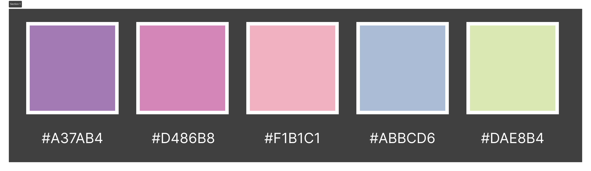

# Kate Brush Illustration Portfolio

This is my Milestone 1 project, which has been designed to showcase my own illustration work as an online portfolio.
To keep in concise, I have chosen a selection of my most recent work and displayed in a clear manner for prospective clients and collaborators to get a feel for my artistic style and contact me if desired. Due to alot of people using mobile devices more, especially on the go, I have used the 'mobile first' design technique and made sure the site is fully responsive.

insert image here

<a href="https://www.freepik.com/free-psd/technological-items-mock-up_1153552.htm#query=desktop%20tablet%20phone%20mockup&position=2&from_view=keyword&track=ais">Image by CosmoStudio</a> on Freepik

<a href="https://kateuj.github.io/kate-brush-portfolio/index.html">Link to Kate Brush Portfolio live site</a>

## Table of Contents

1. [Planning & Development](https://github.com/kateuj/kate_brush_portfolio/main/README.md)
2. [Features](https://github.com/kateuj/kate_brush_portfolio/main/README.md#features)
3. [Testing](https://github.com/kateuj/kate_brush_portfolio/main/README.md#planning--development)
4. [Deployment](https://github.com/kateuj/kate_brush_portfolio/main/README.md#planning--development)
5. [Languages](https://github.com/kateuj/kate_brush_portfolio/main/README.md#planning--development)
6. [Software](https://github.com/kateuj/kate_brush_portfolio/main/README.md#planning--development)
7. [Media](https://github.com/kateuj/kate_brush_portfolio/main/README.md#planning--development)
8. [Credits](https://github.com/kateuj/kate_brush_portfolio/main/README.md#planning--development)

# Planning & Development # 

### Business Strategy
As an illustrator, I have come to a stage where I would like to extend my professional presence online. My Instagram profile has gained some leads for work on occasion, but not at the level I would like it to be in an ideal situation.
 
I have wanted to create an Illustration portfolio site with the hope of gaining more clients and collaboration opportunities through people finding my site organically, but also for me to have an easier of demonstrating my abilities within interview settings - a link to a bright, colour, interactive website is far more eye-catching than a PDF portfolio that I have used in the past to show my work to prospective clients in the past.

### Target Audience

Predominently, my target audience will be prospective clients checking my style for suitability of their project, as well as potential collaborators and general visitors with an interest in illustration, that can in theory increase my exposure by sharing my site in their social media so increase my reach.

I collated some research on 'AdTargeting', where I can get an overview of what demographic search for certain key words. I found that the keyword 'illustration' is predominently searched by a female demographic (61%), within the 35-44 age range. Digging a bit deeper, I found that 'digital illustration' is again searched most by females (56%) within the 25-34 age range.

#### Digital Illustration Keyword Search
* 56% Female demographic
* 25-34 age range

This emphasised to me that my site needs to be fully responsive, as younger target audiences are more likely to view sites on their mobile. It has also inspired me from a design perspective, to keep the whole aesthetic bright and fun to be appealing to younger audiences, as well as potentially looking at a pastel colour palette to give an overall feminine feel to the site.

### User Needs

#### New Users
1. View work to check suitability for a project
2. Know how to contact me

#### Returning Users

1. Check for portfolio updates

    
### Site Objectives

  - To

### Approach

  - The information will be provided to the user logically and informed by planning research.  

  - The site will be created following the principles of user experience design.

  - The site will provide users links through which they can book tickets to see the band.

  - The site will provide users with map links to venue locations and the option to add gig dates to Google calender.

  - The site will provide users with access to exclusive media content such as embedded audio files, youtube videos and a photo gallery.

  - The content of the site will be inoffensive and accesible to all.

  - The site will be easy to navigate, intuitive and consistent in design.

  - The site will provide a method through which users can subscribe to a mailing list.

### Wireframes

    Desktop, tablet and mobile wireframes w

### Color Scheme

  

### Typography

- There ar.

# Features #

Below are so

### Business Objectives

<li>Examples of my illustration work
<li>An introduction to me and my professional experience
<li>A contact form to get in touch
<li>Links to my social media
<li>A link to my external Patreon
<li>Bar to signal when there has been a portfolio update

## Existing Features ##

- __Navigation Bar__

  - The navigation bar 

 

- __Possible Future Features__

  - 

     

# Testing

- __Testing During Development__

  - Testing Technologies

     

    I rigorously tested the site during the development phase using using the following:

- __Testing the Home page__

- __Testing the Portfolio page__
  
  
- - __Testing the About Me page__

- __Validator Testing__

I ran all of the sites pages through the W3C validator and each page returned multiple errors.

I corrected the code and all four pages now return no html errors.

- The CSS stylesheet was passed through the Jigsaw Validator and returned no errors.

 

- __Performance Testing__

    

 

- __Other Bug Fixes__

  - On some touchscreen devices an error occurs due to the hover psuedo class which fails to deselect a nav link when a user returns to the previous page via the back arrow.

     

    This bug was fixed by the inclusion of the "inactive" class selector and by setting the nav link elements to display=hidden on smaller screen sizes.

     

     

 

- __Unfixed Bugs__

# Deployment

- The site was deployed to GitHub pages. The steps to deploy are as follows:
  - From this project's repository, navigate to the settings tab
  - From the left hand menu, select pages.
  - From the source section drop-down menu, select the Main Branch.
  - Once the main branch has been selected, the page will refresh and provide a link to the live project.

The live link can be found here - <https://davidcalikes.github.io/portfolio-project-one/index.html>

# Languages

     

# Software

https://getbootstrap.com/docs/5.0/components/navbar/

# Media

-

# Credits

- __Content__

  -

- __Thanks__

  - 