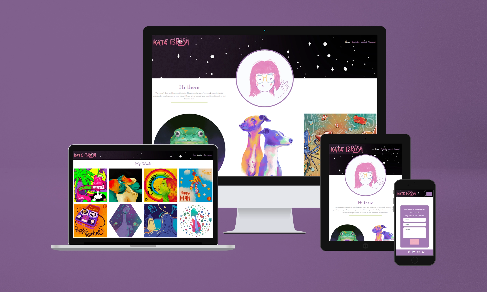
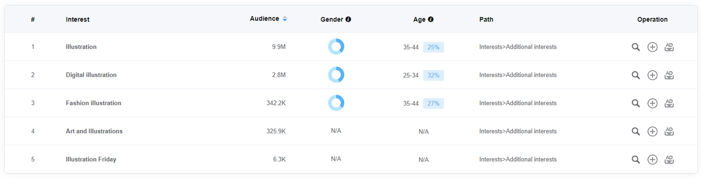
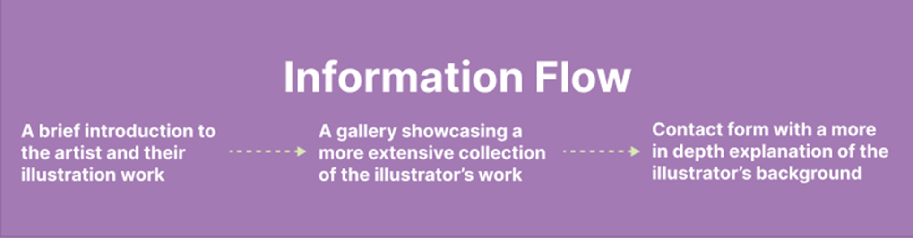
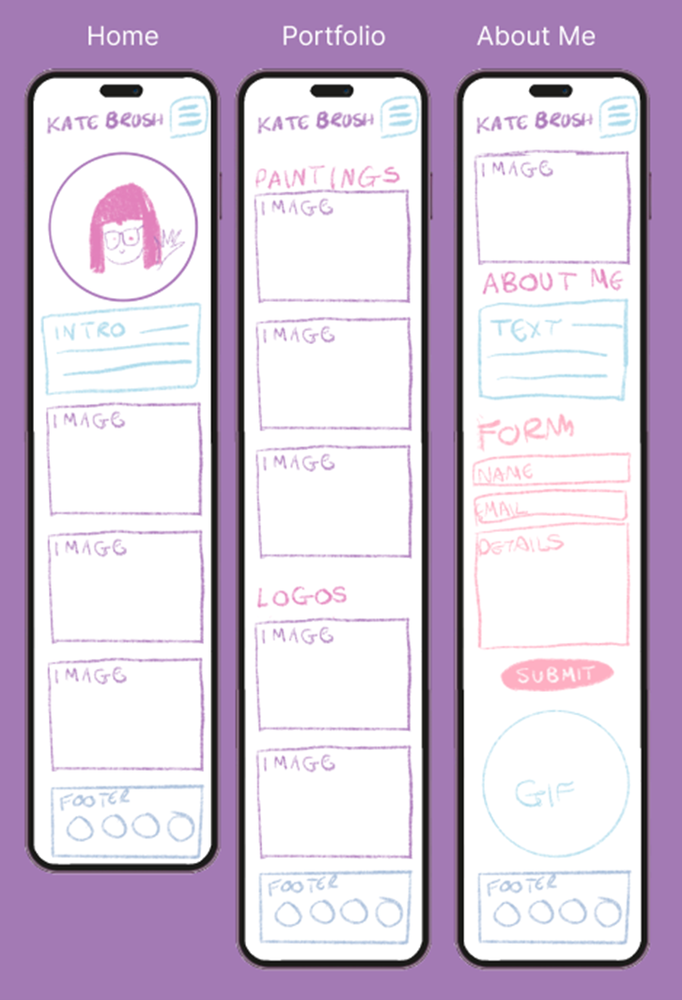
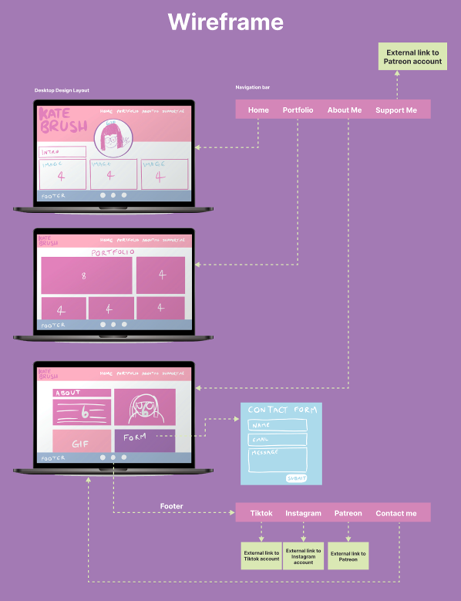
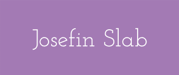

# Kate Brush Illustration Portfolio

This is my Milestone 1 project, which has been designed to showcase my own illustration work as an online portfolio.
To keep in concise, I have chosen a selection of my most recent work and displayed in a clear manner for prospective clients and collaborators to get a feel for my artistic style and contact me if desired. Due to alot of people using mobile devices more, especially on the go, I have used the 'mobile first' design technique and made sure the site is fully responsive.

[Link to Kate Brush Portfolio live site](https://kateuj.github.io/kate-brush-portfolio/index.html)

## Table of Contents

1. [Planning & Development](#planning--development)
2. [Features](#features)
3. [Testing](#testing)
4. [Deployment](#deployment)
5. [Languages](#languages)
6. [Software](#software)
7. [Media](#media)
8. [Credits](#credits)

# Planning & Development #

### Business Strategy
As an illustrator, I have come to a stage where I would like to extend my professional presence online. My Instagram profile has gained some leads for work on occasion, but not at the level I would like it to be in an ideal situation.

I have wanted to create an Illustration portfolio site with the hope of gaining more clients and collaboration opportunities through people finding my site organically, but also for me to have an easier of demonstrating my abilities within interview settings - a link to a bright, colour, interactive website is far more eye-catching than a PDF portfolio that I have used in the past to show my work to prospective clients in the past.

### Target Audience

Predominently, my target audience will be prospective clients checking my style for suitability of their project, as well as potential collaborators and general visitors with an interest in illustration, that can in theory increase my exposure by sharing my site in their social media so increase my reach.

I collated some research on 'AdTargeting', where I can get an overview of what demographic search for certain key words. I found that the keyword 'illustration' is predominently searched by a female demographic (61%), within the 35-44 age range. Digging a bit deeper, I found that 'digital illustration' is again searched most by females (56%) within the 25-34 age range.

#### Digital Illustration Keyword Search
* 56% Female demographic
* 25-34 age range

This emphasised to me that my site needs to be fully responsive, as younger target audiences are more likely to view sites on their mobile. It has also inspired me from a design perspective, to keep the whole aesthetic bright and fun to be appealing to younger audiences, as well as potentially looking at a pastel colour palette to give an overall feminine feel to the site.

### User Needs

#### User Stories
1. Viewing my work to check suitability for a commission
2. Wishing to contact me for a collaboration
3. Wishing to contact me for a commission
3. Checking my portfolio for updates
4. Looking for inspiration for their own illustrative work
    
### Site Objectives

* An introduction to me and my professional experience
* To showcase my work in a bright and fun way to stand out from the crowd
* To build responsive site that works one mobile, tablet and desktop
* Give the user a positive experience
* Make the site clear and concise
* Easy to navigate around and find key information
* Aesthetically pleasing to demonstrate design skills
* A good site flow through carefully planned UI
* Provide the users with a way of contacting me
* To be accessible for screen readers
* Links to my social media

### Approach

* The information will be provided to the user logically and informed by planning research.  
* The site will be created following the principles of user experience design.
* The site will provide users links through to my social media accounts for additional content
* The site will provide users with a contact form, should they wish to contact me 
* The site will provide users with access to a gallery of my illustration work.
* The content of the site will be family-friendly and accessible to all.
* The site will be easy to navigate, intuitive with design consistency.

### Research

I conducted some research, looking at other aristic portfolios out there, examining their content, navigation and UI to ensure I could create a competitive online portfolio.

Sites included:
* [Sara Tepes Portfolio](https://www.sarucatepes.com/)
* [Anoosha Syed Portfolio](http://www.anooshasyed.com/)
* [Andrew Thomson Portfolio](https://athomson.art/)

Thoughts noted:
* Handwritten-style logos
* Nav bar at the top of the page
* Responsive design
* Similar user journey - Home - Gallery - Contact
* Same gallery grid for their portfolio
* They have contact forms
* Logos at the top left of the page
* White backgrounds to as to make the images the main focus
* Link to Patreon for users to support the artist

All of the above, I have reflecting in the design of my own website.

### Wireframes

I used Figma and Procreate to plan and design my wireframes and user journey. Figma has been really useful to use as a design board to hold all my inspiration and planning visually in one place. I initially designed the wireframe for my site on mobile first as planned, then proceeded to design desktop wireframes and plan out the user journey and navigation around the site.

#### Mobile Design Wireframe Sketch

#### Desktop Design Wireframe Sketch

[Link to my Figma page](https://www.figma.com/file/mgqUNn2vVWerwPxnTaCVlg/Kate-Brush-Portfolio-Planning-%26-Development-(Community)?type=design&node-id=0%3A1&mode=design&t=aJDzqDB2iJkbcAQF-1)

### Color Scheme

As explained in my target audience research, I wanted to make sure that the colour used in the site was bright and feminine in aesthetic to appeal to a predominantly age 25-34, female audience, which incidentally is the demographic I fall into myself, so I felt it best conveyed my style and personality, which is always important to convey when showcasing any work based on my experience in the industry.
I went for a mix of warm and cool tones to ensure good colour readability contrast can always be achieved, which is important when considering the design of a site from an accessibility point of view.

  

### Typography

Running with the theme of adding personality to my site, as well as finding a typeface that didn't look too corporate alongside my handwritten logo, I went for a serif font to create a classic, nostalgic look. I will to ensure that font-size is large enough in mobile version to ensure good readability. 

# Features #

## Existing Features

### General

* I have made the site responsive, so it can be viewed and used effectively on all screen sizes down to 320px width by 480px height.
* I have made sure that readability contrast has been taken into consideration with all my design work and use of text within the site.

### Logo

* I created my logo using Procreate.
* The process involved handwriting it, then creating a clipping mask with it, to then colour with a gradient to give it a bit more depth.
* An earlier version did not have the gradient on the letters, which felt a bit flat, so I explored ways to make it more dynamic such as colours changes, before making the decision to add a gradient on it.
* I added hand-drawn embellishments to it, similar to what I seen done on logo in my research of other sites.

### Navigation Bar

* I made sure to create a fully responsive navbar for this site so it could be used with ease for all screen sizes especially mobile, as this is most likely how the site will be viewed mostly.
* As screen size reduces the navbar intuitively turns into a collapsible toggler button at the top right corner of the screen
* The logo for the site consistently stays on the top left corner of the screen and is linked to the Home page to make navigating there easier for the user.
* I wanted to make sure from a user journey perspective that the navigation was intuitive and that they user could get to anywhere on the site within 2 or less clicks for ease and positive user experience.
* The colours of the navigation links change as they are hovered over too, to emphasise that they are calls to action. This again aesthetically gives a positive user experience.

### Hero Portrait Animated GIF
* I created an animated gif for the center of the landing page to add to the initial visual impact of the site to draw users in. I have kept it in a hand-drawn style to keep it fun and intriguing for a younger audience and to get my own personality across to the user to make it feel more casual and relatable.

### Contact Form
* To ensure that users can contact me for potential future projects etc. I have included a contact form on my About page. It is fully responsive, changing size to suit screen size.
* It is also in keeping with the colour scheme of the site using CSS to maintain consistency and professionalism across the site.
* Once the user has submitted their form, they are re-directed to a thank-you page to assure them their form has been submitted. They are then re-directed back to the site after 5 seconds for a positive user experience by anticipating their needs. 

### Footer
* I have included links to my social media profiles - Tiktok, Instagram, Patreon within my footer
* They are the standard recognisable icons for each, so easily recognisable by the user.
* The links all open in seperate windows so that the user does not lose the site in their browser and have to manually navigate back, which again is all part of creating a positive, easy user experiene for them.
* I have also added a contact icon for those who know they want to contact me as soon as they land on my website. Link directs them to my About page with contact form available.

## Possible Future Features

### Interactive Portfolio Gallery
* I would to add javascript to the portfolio page to allow users to click on the images and get an embedded pop up of the image full screen, with a title and blurb included with each. This would give a bit more context to the pieces and allow users to view them in more depth if required.

### Announcement Bar
* An annoucement bar that sat above the navigation bar would be desirable to bring to the attention of any user if there have been any updates to the site, for example, new artwork available to view

### A Print Shop

* An online shop where users could buy any of the artwork as a digital or physical print.

### Animated Hero Background

* I attempted a gently scrolling background animation for the Home page but unfortunately I could not get it to function at a standard I was happy with, so in future, I would like to revisit this, as I feel it would have added something to the visual impact of the Home page.

### Live Instagram Feed
* In the future I would love to add a live instagram feed on my portfolio page to show the most up to date artwork, as well as giving the users a feel for who I am, to make me more approachable for users.

# Testing

## Testing during Development

* Throughout the process of making this website, I tested my code and CSS alot using the preview window extension within VS Code, as well as within a chrome browser. With chrome browser I could Google Dev-tools to test responsiveness as well as troubleshoot any spacing issues or bugs.
* I would also consistently commit and push work to Github to then view live site and check responsiveness on my mobile and tablet devices, as well as passing onto friends and family to test on their devices.
* I have also tested my site in the main browsers available, which include:

  * Google Chrome
  * Mozilla Firefox
  * Apple Safari
  * Microsoft Edge

### Testing the Home page

### Testing the Portfolio page
  
  
### Testing the About page

## Validator Testing

I ran all of the sites pages through the W3C validator and each page returned multiple errors.

I corrected the code and all four pages now return no html errors.

- The CSS stylesheet was passed through the Jigsaw Validator and returned no errors.

## Performance Testing

## Other Bug Fixes

  - On some touchscreen devices an error occurs due to the hover psuedo class which fails to deselect a nav link when a user returns to the previous page via the back arrow.

    This bug was fixed by the inclusion of the "inactive" class selector and by setting the nav link elements to display=hidden on smaller screen sizes.

## Unfixed Bugs

# Deployment

* I used GitHub pages to deploy my site. This required me to go to my project repository and then:
  * Click on the 'Settings' tab
  * Select 'Pages' from the menu that appears on the left
  * Select 'Deploy from a branch'
  * Select 'Main' in the drop-down menu called 'Select Branch'
  * Then alongside 'Main', there is a folder dropdown where you select '/Root'
  * Click 'Save' button
  * Refresh the page and a link to the live project will appear at the top of the page

Here is the live link to my website - <https://kateuj.github.io/kate-brush-portfolio/index.html>

# Languages

* I used HTML and CSS to create this site.
* Boostrap v5.3.2 was also used and built upon for features such as the responsive navigation bar and page layout.

# Media Queries

* Media queries were used to debug and override some display issues that were not rectified with Bootsrap's responsive layouts.

# Software

* I used Visual Studio Code to create, edit, preview and push my code to my Github repository.
* Git and Github for version control.
* Procreate  was used for my sketches, planning and design work, as well for producing the logo, hero background image and both animated GIFs on the site.
* Figma was used as a design board to lay out my wireframes and keep a copy of my design thought process all in one place.
* Adobe Photoshop was used to create visual mockups for this document, as well as reformatting all my images as .webp files to reduce file size and inturn improve the performance of my site.

# Media
* [Image for visual mock up at top of README document by CosmoStudio</a> on Freepik](https://www.freepik.com/psd/desktop-tablet-phone-mockup)
* All illustrations, animated GIFs and images are my own work under my pseudonym 'Kate Brush'.

# Credits

## Content

* https://getbootstrap.com/docs/5.0/components/navbar/

### Thanks

* 

* The big and little human beings of the Ulloa-James household who have been very patient with me, allowing me the time day or night to focus on this project.