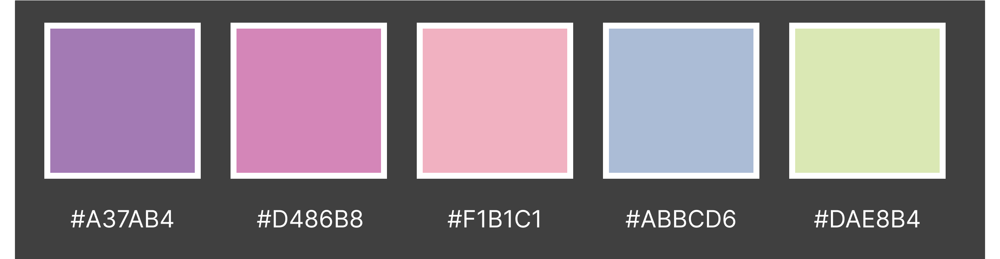

# Kate Brush Illustration Portfolio

This is my Milestone 1 project, which I have designed to display my own illustration work as an online portfolio.
To keep it concise, I have chosen a selection of my most recent work and displayed in a clear manner for prospective clients and collaborators to get a feel for my artistic style and contact me if desired. Due to a lot of people using mobile devices more, especially on the go, I have used the 'mobile first' design technique and made sure the site is fully responsive.

[Link to Kate Brush Portfolio live site](https://kateuj.github.io/kate-brush-portfolio/index.html)

## Table of Contents

1. [Planning & Development](#planning--development)
2. [Features](#features)
3. [Testing](#testing)
4. [Deployment](#deployment)
5. [Languages](#languages)
6. [Media Queries](#media-queries)
7. [Software](#software)
8. [Code](#code)
9. [Credits](#credits)

# Planning & Development #

### Business Strategy
As an Illustrator, I have come to a stage where I would like to extend my professional presence online. My Instagram profile has gained some leads for work on occasion, but not at the level I would like it to be in an ideal situation.

I have wanted to create an Illustration portfolio site with the hope of gaining more clients and collaboration opportunities through people finding my site organically, but also for me to have an easier of demonstrating my abilities within interview settings - a link to a bright, colour, interactive website is far more eye-catching than a PDF portfolio that I have used in the past to show my work to prospective clients in the past.

### Target Audience

Predominantly, my target audience will be prospective clients checking my style for suitability of their project, as well as potential collaborators and general visitors with an interest in illustration, which can in theory increase my exposure by sharing my site in their social media so increase my reach.

I collated some research on 'AdTargeting', where I can get an overview of what demographic search for certain key words. I found that the keyword 'illustration' is predominantly searched by a female demographic (61%), within the 35-44 age range. Digging a bit deeper, I found that 'digital illustration' is again searched most by females (56%) within the 25-34 age range.

#### Digital Illustration Keyword Search
* 56% Female demographic.
* 25-34 age range.

This emphasised to me that my site needs to be fully responsive, as younger target audiences are more likely to view sites on their mobile. It has also inspired me from a design perspective, to keep the whole aesthetic bright and fun to be appealing to younger audiences, as well as potentially looking at a pastel colour palette to give an overall feminine feel to the site.

### User Needs

#### User Stories
1. Viewing my work to check suitability for a commission.
2. Wishing to contact me for a collaboration.
3. Wishing to contact me for a commission.
4. Checking my portfolio for updates.
5. Looking for inspiration for their own illustrative work.

### Site Objectives

* An introduction to me and my professional experience.
* To display my work in a bright and fun way to stand out from the crowd.
* To build responsive site that works one mobile, tablet and desktop.
* Give the user a positive experience.
* Make the site clear and concise.
* Easy to navigate around and find key information.
* Aesthetically pleasing to demonstrate design skills.
* A good site flow through carefully planned UI.
* Provide the users with a way of contacting me.
* To be accessible for screen readers.
* Links to my social media.

### Approach

* The information will be provided to the user logically and informed by planning research.
* The site will be created following the principles of user experience design.
* The site will provide users links through to my social media accounts for additional content
* The site will provide users with a contact form, should they wish to contact me 
* The site will provide users with access to a gallery of my illustration work.
* The content of the site will be family-friendly and accessible to all.
* The site will be easy to navigate, intuitive with design consistency.

### Research

I conducted some research, looking at other artistic portfolios out there, examining their content, navigation and UI to ensure I could create a competitive online portfolio.

Sites included:
* [Sara Tepes Portfolio](https://www.sarucatepes.com/)
* [Anoosha Syed Portfolio](http://www.anooshasyed.com/)
* [Andrew Thomson Portfolio](https://athomson.art/)

Thoughts noted:
* Handwritten style logos.
* Nav bar at the top of the page.
* Responsive design.
* Similar user journey - Home - Gallery - Contact.
* Same gallery grid for their portfolio.
* They have contact forms.
* Logos at the top left of the page.
* White backgrounds to as to make the images the main focus.
* Link to Patreon for users to support the artist.

All of the above, I have reflecting in the design of my own website.

### Wireframes

I used Figma and Procreate to plan and design my wireframes and user journey. Figma has been really useful to use as a design board to hold all my inspiration and planning visually in one place. I initially designed the wireframe for my site on mobile first as planned, then proceeded to design desktop wireframes and plan out the user journey and navigation around the site.

#### Mobile Design Wireframe Sketch

#### Desktop Design Wireframe Sketch

[Link to my Figma page](https://www.figma.com/file/mgqUNn2vVWerwPxnTaCVlg/Kate-Brush-Portfolio-Planning-%26-Development-(Community)?type=design&node-id=0%3A1&mode=design&t=aJDzqDB2iJkbcAQF-1)

### Colour Scheme

As explained in my target audience research, I wanted to make sure that the colour used in the site was bright and feminine in aesthetic to appeal to a predominantly age 25-34, female audience, which incidentally is the demographic I fall into myself, so I felt it best conveyed my style and personality, which is always important to convey when showcasing any work based on my experience in the industry.
I went for a mix of warm and cool tones to ensure good colour readability contrast is always achieved, which is important when considering the design of a site from an accessibility point of view.

### Typography

Running with the theme of adding personality to my site, as well as finding a typeface that didn't look too corporate alongside my handwritten logo, I went for a serif font to create a classic, nostalgic look. I will need to ensure that font-size is large enough in mobile version to ensure good readability. 

# Features #

## Existing Features

### General

* I have made the site responsive, so it can be viewed and used effectively on all screen sizes down to 320px width by 480px height.
* I have made sure that readability contrast has been taken into consideration with all my design work and use of text within the site.
* Favicon page tab icons have been added to each page to make the page look more professional.

### Logo

* I created my logo using Procreate.
* The process involved handwriting it, then creating a clipping mask with it, to then colour with a gradient to give it a bit more depth.
* An earlier version did not have the gradient on the letters, which felt a bit flat, so I explored ways to make it more dynamic such as colours changes, before making the decision to add a gradient on it.
* I added hand-drawn embellishments to it, similar to what I seen done on logo in my research of other sites.

### Navigation Bar

* I made sure to create a fully responsive navbar for this site so it could be used with ease for all screen sizes especially mobile, as this is most likely how the site will be viewed mostly.
* As screen size reduces the navbar intuitively turns into a collapsible toggler button at the top right corner of the screen.
* The logo for the site consistently stays on the top left corner of the screen. It is linked to the Home page to make navigating there easier for the user.
* I wanted to make sure from a user journey perspective that the navigation was intuitive and that they user could get to anywhere on the site within 2 or less clicks for ease and positive user experience.
* The colours of the navigation links change as they are hovered over too, to emphasise that they are calls to action. This again aesthetically gives a positive user experience.

## Home page

### Hero Portrait Animated GIF

* I created an animated gif for the centre of the landing page to add to the initial visual impact of the site to draw users in. I have kept it in a hand-drawn style to keep it fun and intriguing for a younger audience and to get my own personality across to the user to make it feel more casual and relatable.

### Footer

* I have included links to my social media profiles - TikTok, Instagram, Patreon within my footer.
* They are the standard recognisable icons for each, so easily recognisable by the user.
* The links all open in separate windows so that the user does not lose the site in their browser and have to manually navigate back, which again is all part of creating a positive, easy user experience for them.
* I have also added a contact icon for those who know they want to contact me as soon as they land on my website. Link directs them to my About page with contact form available.

## Portfolio page

### Image Gallery

* Using the Bootstrap Grid system, I created a responsive image gallery to showcase my work on my Portfolio page.

## About page

### Contact Form

* To ensure that users can contact me for potential future projects etc. I have included a contact form on my About page. It is fully responsive, changing size to suit screen size.
* It is also in keeping with the colour scheme of the site using CSS to maintain consistency and professionalism across the site.
* Once the user has submitted their form, they are re-directed to a thank-you page to assure them their form has been submitted. They are then, re-directed back to the site after 5 seconds for a positive user experience by anticipating their needs.

### Embedded Video

* To add some more engaging content to my site for the user on my About page, I embedded a video of a short film I made, so they get an informal, fun insight into my hobbies and personality.

## Thank you page

* Users are directed to this page when they submit a contact form. It re-directs back to site after 5 seconds. 

## Possible Future Features

### Interactive Portfolio Gallery
* I would like to add JavaScript to the portfolio page to allow users to click on the images and get an embedded pop up of the image full screen, with a title and blurb included with each. This would give a bit more context to the pieces and allow users to view them in more depth if required.

### Announcement Bar
* An announcement bar that sat above the navigation bar would be desirable to bring to the attention of any user if there have been any updates to the site, for example, new artwork available to view.

### A Print Shop

* An online shop where users could buy any of the artwork as a digital or physical print.

### Animated Hero Background

* I attempted a gently scrolling background animation for the Home page but unfortunately I could not get it to function at a standard I was happy with, so in future, I would like to revisit this, as I feel it would have added something to the visual impact of the Home page.

### Live Instagram Feed
* In the future I would love to add a live Instagram feed on my portfolio page to show the most up to date artwork, as well as giving the users a feel for who I am, to make me more approachable for users.

# Testing

## Testing during Development

* Throughout the process of making this website, I tested my code and CSS a lot using the preview window extension within VS Code, as well as within a chrome browser. With chrome browser I could Chrome Developer Tools to test responsiveness as well as troubleshoot any spacing issues or bugs.
* I would also consistently commit and push work to Github to then view live site and check responsiveness on my mobile and tablet devices, as well as passing onto friends and family to test on their devices.
* I have also tested my site in the main browsers available, which include:

  * Google Chrome
  * Mozilla Firefox
  * Apple Safari
  * Microsoft Edge

### Testing the Home page
* **Navigation Bar**
  * First thing I tested was the nav bar to check all links worked correctly. I also checked the external link for 'Support' opened a new window, so as not to navigate the user away from my site completely.
  * This nav bar is based on a responsive Bootstrap snippet available, which I edited to suit colour scheme and typeface, as well as background image.
  * Getting the nav bar to be a suitable thickness for different screen sizes took some tweaking in CSS with media queries, cross-checking my edits in the VS code live preview to get it to look effective.
  * Initially the background of the nav bar was not showing the same part of the image as the hero background behind as the screen size got smaller, but after trouble shooting, I found a simple fix was to put 'fixed' in the CSS for the nav bar background to have it move and reduce in the same way as the hero background.
  * It was brought to my attention from a user looking at the website, that the external visited link 'Support' in my navigation bar were turning black, and in turn making it not visible. To fix this I added the piece of code below to change the colour of visited links to the same as the default font colour, which fixed the issue.

* **Body content**
  * I have used the Bootstrap grid system in my site to structure my pages, as I found it to be reliable to use in the Code Institute exercises for responsiveness. So, I tested this section with Chrome Developer Tools, editing with CSS and media queries to make sure responsiveness was suitable on all screen sizes.
  * The portrait GIF in the centre was initially appearing under the nav bar on smaller screens when tested, so I resolved this by creating media queries for the smaller screen sizes to change the top margin above it where appropriate.
  * The 3 images were impactful on the larger screens but from tablet screen-size downward, the two image on one line was enough, so I change my strategy in the end to make the third image disappear on smaller screens using a media query.

* **Footer**
  * An initial bug that I worked on, was a white space below the footer, which I checked over in Chrome Developer Tools initially but was still unsure as to the resolution. After doing some research, I found help at the following site for a simple piece of CSS code: [30 Seconds of Code](https://www.30secondsofcode.org/css/s/footer-at-the-bottom/#:~:text=This%20is%20done%20by%20setting,it%20and%20its%20previous%20sibling)
  * I then tested all the links to make sure they worked and that the external links to social media accounts, opened new windows for the links when clicked on. This all worked effectively.
  * The footer was not appearing vertically or horizontally centralised throughout the site, even though the styling was centred. Upon closer inspection in Chrome Developer Tools, I found a margin underneath the icons, as well as padding on the left. I tested a solution in the Developer Tools to cancel these out, found it to be successful and then proceeded to add it into my own CSS code.

  

### Testing the Portfolio page

* **Header**
  * Testing showed that the headers throughout the site all consistently followed the styling CSS rule I had created for them.
  
* **Image Grid**
  * When testing responsiveness of this section, I found that the right margin was not equal to the left, causing the image grid to not sit centrally on the page. After some trial and error, I put the image grid into a separate div container from the header, which resolved the issue.

### Testing the About page

* **Text section**
  * Through a lot of trial and error, I tested this page the most rigorously for responsiveness, as I found it to be the most complex content and layout-wise. I evaluated the paragraph text on smaller screens and found it to be too small to comfortably read, so I increased the font size with media queries for the smaller screens.
  * I also found my line break element was not displaying central to the text when originally tested and I could not centralise it with CSS initially. However after researching it, I managed to solve this bug after learning about margin inline CSS rules at this site [MDN Web Docs](https://developer.mozilla.org/en-US/docs/Web/CSS/margin-inline).
  * I also had an issue where the line break was appearing at a low opacity, which must have been a carried over style from the Bootstrap code in my site. To resolve this bug, I declared 100% opacity on the hr elements.

* **Image and GIF**
  * When tested on different screen sizes I had a lot of issues with the image and the GIF on this page not being responsive and causing there to be a large white margin on the right-hand side of the site and a horizontal scroll. I found the fix to this bug in the end to be setting the width of each to '50vh' on the desktop and tablet screens to keep it responsive and make sure it never caused an overhang.

* **Contact Form**
  * I based this form on the code we learnt in the 'Love Running' exercise I completed. Upon testing my styling, I found the margins to be too wide on smaller screens, which I sorted with a media query to reduce them in size.
  * I tested the submit button to find that it does take the user to a thank-you and successfully re-direct back to site after 5 seconds.

### Testing the Thank you page
  * Successfully re-directs back to site after 5 seconds when tested.
  * Tested responsiveness of text and GIF, all of which work effectively.

## Validator Testing

### W3C Validator
I ran my site pages through the W3C validator and I received multiple errors. These included:

* 'Trailing slash on void elements' on all pages, where some elements in the header had unnecessary slashes at the end of their tags.

* Remove sections, just use DIVs when the content did not include headers.

* Needed to move a paragraph end tag above the "hr" element on the Index page.

* Had a stray end div on the Portfolio page.

* Unclosed div elements, which I resolved by adding in end tags.

* JavaScript placement was causing an error, as it was placed after the body tag, so needed to move to inside body tag to resolve the issue.

I corrected the code and all three pages now return no html errors.

### CSS Jigsaw Validator
I put the CSS stylesheet through the Jigsaw Validator and it returned no errors.

## Performance Testing

Using the Chrome Developer Tools Lighthouse reports, I was able to test the performance of my site pages and improve it as a result.

### Desktop
My initial desktop performance came out as below:

  

To improve my score, I did the following:
* Updated button text colour in form to a darker colour to improve readability contrast and site accessibility.

* Added aria labels to the links across the site to improve accessibility score.
* Reduced image sizes to improve performance.

* Added meta description and author tags to all pages to improve SEO score.

My score improved after all these changes:

### Mobile

The same errors for desktop came up in mobile as well, but after the same tweaks, the performance came out as:

* Performance on mobile could still be improved by reducing image sizes.

# Deployment

## GitHub pages
I used GitHub pages to deploy my site. This required me to go to my project repository and then:
1. Click on the 'Settings' tab.
2. Select 'Pages' from the menu that appears on the left.
3. Select 'Deploy from a branch'.
4. Select 'Main' in the drop-down menu called 'Select Branch'.
5. Then alongside 'Main', there is a folder dropdown where you select '/Root'.
6. Click 'Save' button.
7. Refresh the page and a link to the live project will appear at the top of the page.

## Forking a GitHub repository
Forking allows users to make a copy of an original repository in GitHub and view and make changes to it without changing the original repository.
To create a fork:
1. Once logged into GitHub, follow the link to your chosen GitHub repository, or use the search bar to find it on the GitHub home page.
2. Once in the repository window, click the 'Fork' drop down arrow button in the top right-hand corner.
3. Select 'Create new fork'.
4. Check the details in the window before clicking the green 'Create Fork' button.
5. You will now be able to find the copy of the repository in your own GitHub account.

## Making a Local Clone
1. Once logged into GitHub, follow the link to your chosen GitHub repository, or use the search bar to find it on the GitHub home page.
2. Once in the repository window, click the green 'Code' button.
3. To clone the repository using HTTPS, copy the link provided below the HTTPS header.
4. Open a terminal in your code editor.
5. Change the location in the current working directory to where you want the cloned directory to be created.
6. Type "git clone" into the terminal, and then paste the URL you copied and click enter.
7. This should have created a local clone of the repository.

Here is the live link to my website - <https://kateuj.github.io/kate-brush-portfolio/index.html>

# Languages

* I used HTML and CSS to create this site.
* Bootstrap v5.3.2 was used and built upon for features such as the responsive navigation bar and page layout.

# Media Queries

* I used Media Queries to debug and override some display issues that were not rectified with Bootstrap's responsive layouts.

# Software

* I used Visual Studio Code to create, edit, preview and push my code to my Github repository.
* Git and Github for version control.
* I used Procreate for my sketches, planning and design work, as well for producing the logo, hero background image and both animated GIFs on the site.
* Figma was used as a design board to lay out my wireframes and keep a copy of my design thought process all in one place.
* Adobe Photoshop was used to create visual mock-ups for this document, as well as reformatting all my images as .webp files to reduce file size and in turn improve the performance of my site.

# Code
* **Navigation Bar** - I tailored this [Bootstrap code](https://getbootstrap.com/docs/5.0/components/navbar/) snippet to create my Navigation bar.

* **Contact form** - this was based on the code used in the 'Love Running' exercise of Code Institute.

* **Footer** - code is based on the code used in the 'Love Running' exercise of Code Institute.

* **Thank-you page** - I used this code snippet to get the Thank You page to re-direct back to the site after 5 seconds. This was from a [Stack Overflow thread.](https://stackoverflow.com/questions/3292038/redirect-website-after-specified-amount-of-time)

* **Favicon** - I used a [Favicon generator](https://favicon.io/) to create the appropriate files for me to upload to my site, as well as this code snippet to install it site-wide.

# Credits

* Code Institute Bootstrap lessons helped me with working out how to use the Bootstrap grid layout on my pages.
* Google fonts for ['Josefin Slab' typography.](https://fonts.google.com/specimen/Josefin+Slab)

## Content

* [Image for visual mock up at top of README document by CosmoStudio</a> on Freepik.](https://www.freepik.com/psd/desktop-tablet-phone-mockup)
* All illustrations, animated GIFs and images are my own work under my pseudonym 'Kate Brush'. I filmed, animated, created and produced the video, with music from the band 'The Andales' and actor credits stated in the video.

### Thanks

* [Harsivo Edu](https://www.youtube.com/watch?v=lYiE5lBS13E&ab_channel=HarsivoEdu) for teaching me how to set up VS Code.
* Martina Terlevic my CI mentor, for her invaluable advice.
* [Kera Cudmore](https://github.com/kera-cudmore/readme-examples/blob/main/README.md#italic-bold-and-code) for showing how to form a README file.
* Rob McLaughlin for his positivity and encouragement.
* Claire Fisher for introducing me to Figma and VS code.
* The big and little human beings of the Ulloa-James household who have been very patient with me, allowing me the time day or night to focus on this project.